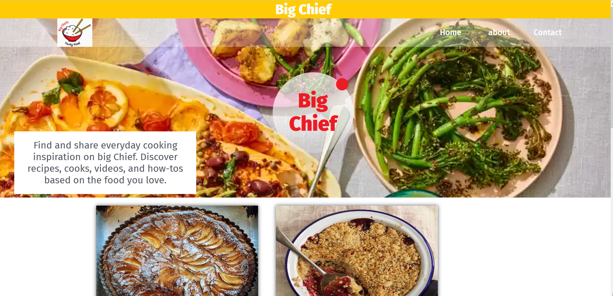
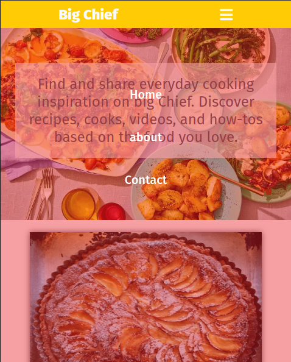

# Big Chief
> Big Chief is a website where you find and share everyday cooking inspiration. Discover recipes, cooks, videos, and how-tos based on the food you love.

## Video link
Video link [here](https://drive.google.com/file/d/1hjawdycWo_agZzfFYI7vjqZvhnHptycg/view?usp=sharing )

## Built With

- HTML
- CSS
- Javascript
- Webpack

### Prerequisites
The basic requirements for building the executable are:

- A working browser application (Google chrome, Mozilla Fire fox, Microsoft edge ...)
- VSCode or any other equivalent code editor
- Node Package Manager (For running, debuging, or installing dependancies to be used)

### Setup
>https://github.com/LionRouge1/Javascript_capstone_poject

### Install
Getting packages and debuging with Stylelint
>npm install --save-dev stylelint@13.x stylelint-scss@3.x stylelint-config-standard@21.x stylelint-csstree-validator@1.x

Getting packages and debuging with Webhint
>npm init -y
>npm install --save-dev hint@6.x

Getting packages and debuging with Eslint
>npm install --save-dev eslint@7.x eslint-config-airbnb-base@14.x eslint-plugin-import@2.x babel-eslint@10.x

### Run tests
To run this project do the following tasks :

- git clone https://github.com/LionRouge1/Javascript_capstone_poject  
- cd Javascript_capstone_poject  

- npm install  
- npm run start  

## Authors

👤 **Matchoudi**

- GitHub: [@githubhandle](https://github.com/LionRouge1)

👤 **Ifza Arain**

- GitHub: [@githubhandle](https://github.com/IfzaRasool)

## 🤝 Contributing

Contributions, issues, and feature requests are welcome!

Feel free to check the [issues page](../../issues/).

## Show your support

Give a ⭐️ if you like this project!

## Acknowledgments

- Hat tip to anyone whose code was used
- Inspiration
- etc

## 📝 License

This project is [MIT](./MIT.md) licensed.